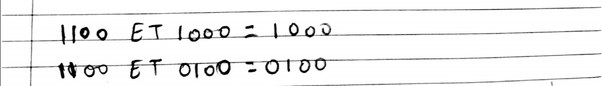
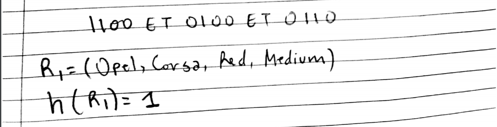
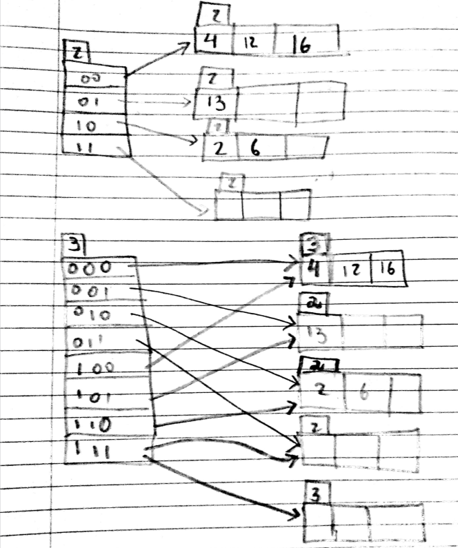

# Devoir 2 CSI2532

## Q1: Normalisation

Considérez une relation avec le schéma R(A, B, C, D) et l'ensemble F des dépendances fonctionnelles:

```Bash
F = {
 AB → C,
 C → D,
 D → A
}
```

### a. Trouver toutes les clés candidates de R

Les clés candidates que j'ai obtenu sont: AB,DB,CB

### b. Indiquez toutes les violations de BCNF pour R et décomposez les relations en collections qui sont dans BCNF.

Les éléments suivants violent BCNF:

```
C -> D
D -> A
```
Pour être dans BCNF, voici les relations décomposées:
```
R1=(A,B,C)
R2=(C,D)
R3=(D,A)
```

### c. Indiquez quelles dépendances, s'ils existent, qui ne sont pas conservées par la décomposition BCNF.

Les deux dépendances suivantes ne sont pas conservées par la décomposition BCNF:
```
AB -> D
C -> A
```

## Q2: Dépendances fonctionnelles

Une agence appelée InstantCover fournit du personnel à temps partiel / temporaire aux hôtels de toute l'Écosse. Le tableau suivant montre le temps inscrit par les personnels de l'agence travaillant dans deux hôtels.

NIN | contractNo | hoursPerWeek | eName | hotelNo | hotelLocation
----|------------|--------------|-------|---------|--------------
113567WD|C1024|16|John Smith|H25|Edinburgh
234111XA|C1024|24|Diane Hocine|H25|Edinburgh
712670YD|C1025|28|Sarah White|H4|Glasgow
113567WD|C1025|16|John Smith|H4|Glasgow

Le numéro d'assurance nationale (NIN) est unique pour chaque employé. Avec le NIN et le numéro du contrat ( contractNo ), on peut déterminer les heuresPerWeek que l'employé à travailler. Le NIN permet également à l'entreprise de connaître le nom de l'employé ( eName ). Utilisation de hotelNo on sait le lieu de l'hôtel. Chaque contratNo est associé à un hôtel particulier, ce qui signifie qu'avec le contratNo on connaît également l' hotelNo .

### a. Sur informations ci-dessus, identifiez les quatre dépendances fonctionnelles décrites.

Voici les 4 dépendances fonctionnelles que j'ai trouvé:
```
{NIN, contractNo} -> hoursPerWeek
NIN -> eName
hotelNo -> hotelLocation
contractNo -> hotelNo
```

### b. Liste toutes les clés candidates.

En me basant sur les dépendances obtenues en (a), j'ai trouvé les deux clés candidates suivantes:
```
{NIN, contractNo, hotelNo} représenterait tous les trois ensembles la première clé candidate (NINcontractNohotelNo)
{NIN, contractNo} représente tous les deux ensembles la deuxième clé candidate (NINcontractNo)
```

### c. Normaliser la relation avec la troisième forme normale (3NF) montrer les relations résultantes.

## Q3: Langues pures

Considérez les relations suivantes:

```Bash
Sailors(sid, sname, rating, age)
Reserves(sid, bid, day)
Boat(bid, bname, bcolor)
```

Écrivez des expressions en algèbre relationnelle (RA), calcul relationnel tuple (TRC) ou calcul relationnel de domaine (DRC) comme indiqué pour les requêtes suivantes:

### a. (RA) Listez les couleurs des bateaux réservés par Albert.


### b. (RA) Listez les identifiants de tous les marins ayant une évaluation (rating) d'au moins 8 ou un bateau réservé 103.


### c. (TRC) Listez les noms et l'âge de tous les marins qui ont une évaluation inférieure à 3.


### d. (RDC) Listez les identifiants de tous les bateaux réservés le 2019-04-28.


### e. (RDC) Listez les couleurs de tous les bateaux réservés par le marin Lubber.


## Q4: RAID

Déclaration | Correspond à | Déclaration
------------|--------------|------------
1- Je peux utiliser une technique RAID niveau 0 car |B| A - la tolérance aux pannes est importante pour mon application et je dois protéger mes données même si deux disques tombent en panne en même temps.
2- Je peux utiliser une technique RAID niveau 1 car |E| B - Je n'inquiet pas de perdre les données. Mon objectif principal est de pouvoir lire et écrire à grande vitesse.
3- Je peux utiliser une technique RAID niveau 5 car |D| C - J'ai 6 disques disponibles mais j'ai besoin de la capacité de 5 d'entre eux ce qui signifie que je ne peux pas gaspier l'espace qu'un seul disque pour assurer la redondance.
4- Je peux utiliser une technique RAID niveau 6 car |A| D - Je n'ai que deux disques disponibles, ce qui représente plus du double de la capacité dont j'ai besoin pour mon application et je veut être capable de récupérer les données si nécessaire.
5- Je préfère utiliser une approche paritaire plutôt qu'une approche miroir car |C| E - La tolérance aux pannes est importante pour mon application, mais je n'ai pas beaucoup d'espace disponible.

## Q5: Arbre B+

Considérons l'arbre B+ suivant avec n=4.


### a. Montrez l'arbre B+ qui résulte après l'insertion (dans l'ordre donné) 56, 50, 75, 87, 48.

### b. En utilisant l'arbre B+ précédemment obtenu en (a.), Montrez l'arbre B+ qui résulte après suppression (dans l'ordre donné) 50, 24, 65, 93, 75.

## Q6: Index Bitmap

Considérez l'instance suivante de la relation voitures:

Brand|Type|Color|Risk
-----|----|-----|----
Opel|Corsa|Grey|Low
Opel|Corsa|Red|Medium
Peugeot|206|Black|Medium
BMW|A|Black|High

### a. Construisez un index bitmap pour les attributs marque (Brand) et coleur (Color) de ce tableau.

1. Index Bitmap pour Brand

-Les valeurs présentes sont Opel,Peugeot et BMW.

-On aura donc besoin de 4 bits(rangées)

Brand|R0|R1|R2|R3
-----|--|--|---|--
Opel|Oui|Oui| | |
Peugeot| | |Oui| |
BMW| | | |Oui|

Qui donnera donc:

Brand|R0|R1|R2|R3
-----|--|--|---|--
Opel|1|1|0|0|
Peugeot|0|0|1|0|
BMW|0|0|0|1|

2. Index Bitmap pour Color

-Les valeurs possibles sont Grey, Red et Black

-On aura donc besoin de 4 bits(rangées)

Color|R0|R1|R2|R3
-----|--|--|---|--
Grey|Oui| | | |
Red| |Oui| | |
Black| | |Oui|Oui|

Qui donnera donc:

Color|R0|R1|R2|R3
-----|--|--|---|--
Grey|1|0|0|0|
Red|0|1|0|0|
Black|0|0|1|1|

### b. Montrez comment les indices bitmap peuvent être utilisés pour répondre aux requêtes:

#### i. Montrez la marque (Brand) de toutes les voitures qui ne sont pas noires (Black).



#### ii. Donnez le nombre total de voitures Opel (Opel) rouges (Red) avec un score de risque moyen (Medium).



## Q7: Hachage

Considérez la fonction de hachage suivante h(x) = x mod 4 pour construire un index de hachage. Cette fonction vous permet d'utiliser 4 panier différents. Supposons que chaque compartiment ne peut contenir que 3 entrées d'index.

### a. Utilisez cette fonction pour créer l'index de hachage des valeurs de clé de recherche suivantes: 2, 4, 6, 12, 13, 16, 20, 24, 28, 40

Voici l'index de hachage que j'ai obtenu:



### b. Basé sur ces valeurs de clé de recherche, est-ce que cette fonction est une bonne fonction de hachage? Expliquez votre réponse.

Cette fonction ne semble pas être une bonne fonction de hachage. En effet, il m'était impossible d'ajouter les clés 20,24,28 et 40 dans l'index de hachage obtenu en (a) car les valeurs lorsque divisées par 4, me donnaient toutes un reste de 00 qui représentait un endroit complètement rempli avec les clés 4,12 et 16.
